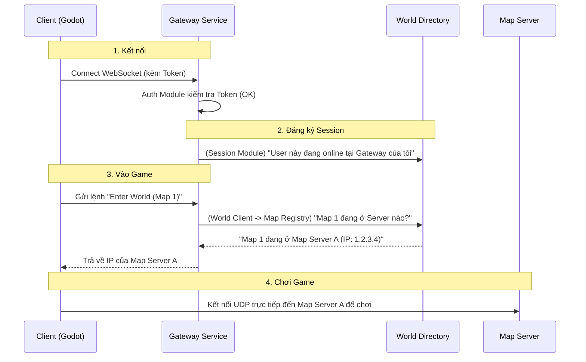

# Backend Architecture Explained

Để dễ hình dung, hãy tưởng tượng hệ thống Backend của bạn giống như một **Khách sạn lớn**.

## 1. Gateway Service (`backend/apps/gateway-service`)

**Vai trò: Lễ tân (Receptionist) / Cửa chính**
Đây là nơi đầu tiên và duy nhất mà Client (người chơi) kết nối trực tiếp. Client không bao giờ nói chuyện trực tiếp với Database hay các service quản lý ngầm.

*   **Các Module bên trong:**
    *   **`gateway` module (Sảnh chính):**
        *   Quản lý kết nối WebSocket (duy trì kết nối thường trực với người chơi).
        *   Nhận các lệnh từ người chơi như "Tôi muốn vào game", "Tôi muốn chuyển map", "Chat hello".
    *   **`auth` module (Bảo vệ):**
        *   Kiểm tra "Vé vào cửa" (JWT Token).
        *   Đảm bảo người chơi là đúng người họ khai báo trước khi cho phép kết nối.
    *   **`world-client` module (Điện thoại nội bộ):**
        *   Gateway không biết Map 1 nằm ở đâu cả. Nó dùng module này để gọi sang `world-directory` hỏi: "Có khách muốn vào Map 1, Map 1 đang nằm ở Server nào?".

---

## 2. World Directory (`backend/apps/world-directory`)

**Vai trò: Cuốn sổ cái / Tổng đài (Central Directory)**
Service này không xử lý logic game, nó chỉ làm đúng một việc: **Biết mọi thứ đang ở đâu**.

*   **Các Module bên trong:**
    *   **`map-registry` module (Quản lý phòng ốc):**
        *   Các **Map Server** (nơi chạy logic game thật sự) khi khởi động sẽ báo cáo về đây: "Tôi là Server A, tôi đang chạy Map 1 và Map 2 tại địa chỉ IP 10.0.0.1".
        *   Module này lưu thông tin đó lại để khi Gateway hỏi "Map 1 ở đâu?", nó sẽ trả lời ngay.
    *   **`session` module (Danh sách khách đang có mặt):**
        *   Khi người chơi kết nối vào Gateway, Gateway sẽ báo cho module này: "User Cuong đang online ở Gateway 1 nhé".
        *   Giúp hệ thống biết user nào đang online, đang ở đâu, để chặn login trùng (dual login) hoặc gửi tin nhắn.
    *   **`redis` module (Bộ nhớ nhanh):**
        *   Vì thông tin "Ai ở đâu" và "Map nào ở server nào" thay đổi liên tục và cần truy xuất cực nhanh, service này dùng Redis để lưu trữ thay vì Database thông thường.

---

## Sơ đồ luồng đi (Flow)

### Tóm lại:
*   **Gateway Service**: Giữ kết nối với người chơi, chuyển tiếp yêu cầu.
*   **World Directory**: Bộ não trung tâm biết vị trí của tất cả Map Server và Người chơi.
