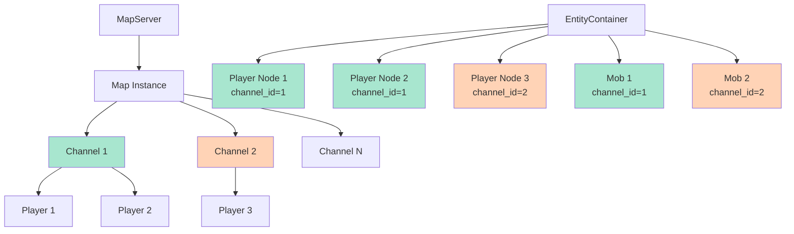
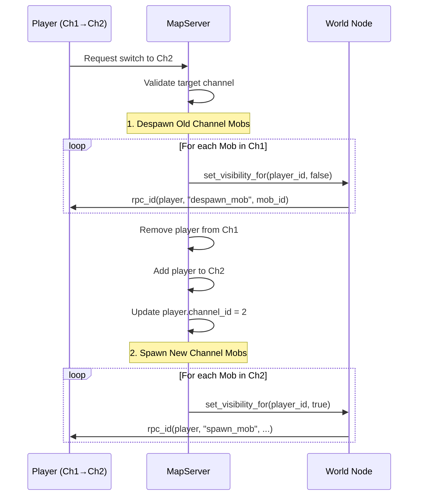

# Channel Isolation System - Phân tích Chi tiết

Tài liệu này phân tích chi tiết cách hệ thống Channel Isolation được triển khai trong MMO RPG Game Server.

## 📋 Tóm tắt nhanh

**Câu hỏi:** Khi thay đổi channel, player có nhìn thấy nhau không? Có tương tác được không? Có bị collision không?

**Trả lời:**

| Khía cạnh | Kết quả | Cơ chế |
|-----------|---------|---------|
| **👁️ Nhìn thấy nhau** | ❌ **KHÔNG** | MultiplayerSynchronizer visibility control |
| **🎯 Tương tác (AI Aggro)** | ❌ **KHÔNG** | Channel ID filtering trong AI logic |
| **💥 Collision vật lý** | ❌ **KHÔNG** (thiết kế) | Collision mask chỉ với World, không với entities |
| **📡 Network Sync** | ❌ **KHÔNG** | Visibility filter + explicit RPC targeting |

> [!IMPORTANT]
> **Kết luận:** Các player ở các channel khác nhau **HOÀN TOÀN CÔ LẬP** - không nhìn thấy, không tương tác, không va chạm với nhau.

---

## 1. Cơ chế Channel Isolation

### 1.1. Kiến trúc Channel System



**Đặc điểm:**
- Tất cả entities (players, mobs) tồn tại trong cùng một `EntityContainer`
- Mỗi entity có thuộc tính `channel_id` để phân biệt
- Isolation được thực thi qua **nhiều lớp** (visibility, AI, network)

---

## 2. Lớp Isolation #1: Network Visibility

### 2.1. MultiplayerSynchronizer Visibility Control

#### Code Reference: [`mob_server.gd:L31-36`](file:///Users/cuongph/Workspace/mmo_rpg_game/server/game/mob_server.gd#L31-L36)

```gdscript
var sync_node = get_node_or_null("MultiplayerSynchronizer")
if sync_node:
    sync_node.set_multiplayer_authority(1)
    
    # Network Optimization: Hide by default, reveal only to channel peers
    sync_node.public_visibility = false
```

**Cơ chế:**
- Mỗi entity có một `MultiplayerSynchronizer` node
- **Mặc định:** `public_visibility = false` → **không ai nhìn thấy**
- **Selective visibility:** Chỉ bật cho players trong cùng channel

### 2.2. Khi Player Join Channel

#### Code Reference: [`map_server.gd:L191-193`](file:///Users/cuongph/Workspace/mmo_rpg_game/server/game/map_server.gd#L191-L193)

```gdscript
# Network Optimization: Open Visibility for this player
if child.has_node("MultiplayerSynchronizer"):
    child.get_node("MultiplayerSynchronizer").set_visibility_for(player_id, true)
```

**Luồng xử lý:**
1. Player join server → assigned Channel 1
2. Server duyệt tất cả mobs
3. **Chỉ mobs có `channel_id == 1`** được set visibility TRUE cho player này
4. Mobs ở Channel 2, 3, ... vẫn invisible

### 2.3. Khi Player Switch Channel

#### Code Reference: [`map_server.gd:L242-244`](file:///Users/cuongph/Workspace/mmo_rpg_game/server/game/map_server.gd#L242-L244)

**Tắt visibility cho channel cũ:**
```gdscript
if mob_channel == old_channel_id:
    if child.has_node("MultiplayerSynchronizer"):
        child.get_node("MultiplayerSynchronizer").set_visibility_for(player_id, false)
```

**Bật visibility cho channel mới:** (L273-275)
```gdscript
if mob_channel == target_channel_id:
    if child.has_node("MultiplayerSynchronizer"):
        child.get_node("MultiplayerSynchronizer").set_visibility_for(player_id, true)
```

### 2.4. Visualization: Visibility Matrix

Channel 1 có Player A, B; Channel 2 có Player C:

```
         +--------+--------+--------+----------+----------+
         |Player A|Player B|Player C| Mob Ch1  | Mob Ch2  |
+--------+--------+--------+--------+----------+----------+
|Player A|   -    | ✅ Thấy| ❌ KHÔNG| ✅ Thấy  | ❌ KHÔNG |
+--------+--------+--------+--------+----------+----------+
|Player B| ✅ Thấy|   -    | ❌ KHÔNG| ✅ Thấy  | ❌ KHÔNG |
+--------+--------+--------+--------+----------+----------+
|Player C| ❌ KHÔNG| ❌ KHÔNG|   -    | ❌ KHÔNG | ✅ Thấy  |
+--------+--------+--------+--------+----------+----------+
```

> [!NOTE]
> **Cơ chế:** Godot's MultiplayerSynchronizer chỉ replicate position/state đến peers có visibility = true. Peers khác **HOÀN TOÀN KHÔNG NHẬN** data.

---

## 3. Lớp Isolation #2: AI Logic Filtering

### 3.1. Aggro Detection (Hostile Mobs)

#### Code Reference: [`mob_ai_component.gd:L158-167`](file:///Users/cuongph/Workspace/mmo_rpg_game/server/game/components/mob_ai_component.gd#L158-L167)

```gdscript
func _check_for_aggro():
    if behavior == "passive" or behavior == "neutral":
        return
        
    var players = mob.get_tree().get_nodes_in_group("player")
    for player in players:
        if not is_instance_valid(player): continue
        
        # Channel Isolation Check
        if player.get("channel_id") != mob.channel_id:
            continue  # ❌ BỎ QUA PLAYER KHÁC CHANNEL
        
        if mob.position.distance_to(player.position) < aggro_range:
            add_threat(player, 1.0)
```

**Logic:**
- Mob quét tất cả nodes trong group "player"
- **Kiểm tra:** `player.channel_id == mob.channel_id`
- Nếu khác channel → `continue` (bỏ qua)
- **Kết quả:** Mob Channel 1 **KHÔNG BAO GIỜ** aggro player Channel 2

### 3.2. Hate Table Cleanup

#### Code Reference: [`mob_ai_component.gd:L72-74`](file:///Users/cuongph/Workspace/mmo_rpg_game/server/game/components/mob_ai_component.gd#L72-L74)

```gdscript
for entity in hate_table.keys():
    if not is_instance_valid(entity) or entity.get("channel_id") != mob.channel_id:
        to_remove.append(entity)
        continue
```

**Kịch bản:**
1. Player ở Channel 1 tấn công Mob Channel 1
2. Mob thêm player vào hate_table
3. Player chuyển sang Channel 2
4. Trong `_update_target()`: Mob phát hiện `player.channel_id != mob.channel_id`
5. **Xóa player khỏi hate_table**
6. Mob mất target → chuyển sang RETURN state

> [!IMPORTANT]
> **Tự động cleanup:** Hate table tự động loại bỏ entities khác channel mỗi frame khi `_update_target()` được gọi.

---

## 4. Lớp Isolation #3: Collision Physics

### 4.1. Collision Mask Configuration

#### Player: [`player_server.gd:L14`](file:///Users/cuongph/Workspace/mmo_rpg_game/server/game/player_server.gd#L14)

```gdscript
# Physics Optimization: Only collide with World (Layer 1)
collision_mask = 1
```

#### Mob: [`mob_server.gd:L26-28`](file:///Users/cuongph/Workspace/mmo_rpg_game/server/game/mob_server.gd#L26-L28)

```gdscript
# Physics Optimization: Only collide with World (Layer 1)
# Disables entity-entity collision (prevents cross-channel blocking)
collision_mask = 1
```

### 4.2. Godot Collision Layers Explained

```
Layer 1 (bit 0): World (Terrain, Walls)
Layer 2 (bit 1): Players (KHÔNG DÙNG)
Layer 3 (bit 2): Mobs (KHÔNG DÙNG)
```

**Collision Mask = 1:**
- Binary: `0000 0001`
- Nghĩa: **Chỉ va chạm với Layer 1** (World)
- **Không va chạm:** Players, Mobs, bất kỳ entity nào khác

### 4.3. Minh họa Collision Matrix

```
            +-------+--------+------+
            | World | Player | Mob  |
+-----------+-------+--------+------+
| World     |  N/A  |   ✅   |  ✅  |
+-----------+-------+--------+------+
| Player    |  ✅   |   ❌   |  ❌  |
+-----------+-------+--------+------+
| Mob       |  ✅   |   ❌   |  ❌  |
+-----------+-------+--------+------+
```

**Giải thích:**
- Players va chạm với World → bị chặn bởi tường
- Mobs va chạm với World → bị chặn bởi tường
- **Players KHÔNG va chạm Players** → đi xuyên qua nhau
- **Players KHÔNG va chạm Mobs** → đi xuyên qua nhau
- **Mobs KHÔNG va chạm Mobs** → đi xuyên qua nhau

> [!CAUTION]
> **Thiết kế:** Collision mask = 1 **KHÔNG PHẢI DO CHANNEL**, mà do **tối ưu performance**. Điều này có nghĩa:
> - Ngay cả players **CÙNG CHANNEL** cũng đi xuyên qua nhau
> - Mobs **CÙNG CHANNEL** cũng không đụng độ với nhau
> 
> **Nếu muốn collision cho cùng channel:**
> Cần cơ chế phức tạp hơn (dynamic collision layer assignment hoặc collision filtering logic).

---

## 5. Lớp Isolation #4: Network RPC Targeting

### 5.1. Spawn/Despawn Mobs cho đúng Channel

#### Code Reference: [`map_server.gd:L388-396`](file:///Users/cuongph/Workspace/mmo_rpg_game/server/game/map_server.gd#L388-L396)

```gdscript
# Iterate players in this channel
var channel_obj = map_instance.get_channel(channel_id)
if channel_obj:
    for pid in channel_obj.players.keys():
        # Network Optimization: Open Visibility
        if mob_node and mob_node.has_node("MultiplayerSynchronizer"):
            mob_node.get_node("MultiplayerSynchronizer").set_visibility_for(pid, true)
            
        world_node.rpc_id(pid, "spawn_mob", unique_id, random_pos, mob_id, is_elite)
```

**Cơ chế:**
- Server không broadcast `spawn_mob` cho tất cả players
- **Chỉ gửi RPC** cho players trong `channel_obj.players`
- Players khác channel **KHÔNG NHẬN** RPC → không spawn mob visually

### 5.2. Channel Switch RPC Flow



**Điểm quan trọng:**
- RPC `despawn_mob` xóa visual client-side ngay lập tức
- RPC `spawn_mob` tạo visual cho channel mới
- Players khác **KHÔNG NHẬN** 2 loại RPC này (không ảnh hưởng)

---

## 6. Kịch bản Thực tế

### 6.1. Scenario: Player A (Ch1) và Player B (Ch2) cùng đứng tại vị trí (100, 100)

```
Server EntityContainer:
├─ Player A (channel_id=1, position=(100,100))
├─ Player B (channel_id=2, position=(100,100))
├─ Mob_1 (channel_id=1, position=(150,100))
└─ Mob_2 (channel_id=2, position=(150,100))
```

**Client của Player A thấy gì?**
- ✅ Thấy chính mình (Player A)
- ❌ **KHÔNG** thấy Player B (visibility = false)
- ✅ Thấy Mob_1 (cùng channel)
- ❌ **KHÔNG** thấy Mob_2 (khác channel)

**Client của Player B thấy gì?**
- ✅ Thấy chính mình (Player B)
- ❌ **KHÔNG** thấy Player A
- ❌ **KHÔNG** thấy Mob_1
- ✅ Thấy Mob_2

**Physics:**
- Player A và B đứng cùng vị trí → **KHÔNG** đụng độ nhau (collision_mask = 1)
- Mobs không chase players khác channel (AI filtering)

### 6.2. Scenario: Player C chuyển từ Channel 1 → Channel 2

**Trước khi switch:**
- Player C thấy: Players Ch1, Mobs Ch1
- Mob Ch1 có thể đang chase Player C (nếu hostile)

**Trong quá trình switch:**
```gdscript
# 1. Tắt visibility tất cả mobs Ch1
for mob in ch1_mobs:
    mob.sync.set_visibility_for(player_c_id, false)
    world.rpc_id(player_c_id, "despawn_mob", mob.id)

# 2. Xóa khỏi hate_table các mobs Ch1
# (Tự động xảy ra trong _update_target() frame tiếp theo)

# 3. Cập nhật player.channel_id = 2

# 4. Bật visibility mobs Ch2
for mob in ch2_mobs:
    mob.sync.set_visibility_for(player_c_id, true)
    world.rpc_id(player_c_id, "spawn_mob", ...)
```

**Sau khi switch:**
- Player C thấy: Players Ch2, Mobs Ch2
- Mobs Ch1 tự động xóa Player C khỏi hate_table (channel_id mismatch)
- Mobs Ch1 không thể target Player C nữa

---

## 7. Edge Cases và Caveats

### 7.1. Players cùng Channel vẫn không va chạm

> [!WARNING]
> **Không phải bug:** Do `collision_mask = 1`, players **CÙNG CHANNEL** cũng đi xuyên qua nhau.
>
> **Lý do:** Tối ưu performance - không cần tính collision cho PvE game.
>
> **Nếu cần PvP collision:**
> Phải implement dynamic collision layer system:
> ```gdscript
> # Ví dụ:
> player.collision_layer = 1 << (channel_id + 1)  # Layer 2, 3, 4...
> player.collision_mask = (1 << 0) | (1 << (channel_id + 1))
> # Mask = World + Same Channel Players
> ```

### 7.2. Mob AI không tấn công players khác channel ngay cả khi overlap

**Code Evidence:**
```gdscript
# mob_ai_component.gd:L163
if player.get("channel_id") != mob.channel_id:
    continue
```

**Kết quả:**
- Mob Channel 1 và Player Channel 2 có thể đứng chồng lên nhau
- Mob **HOÀN TOÀN KHÔNG PHẢN ỨNG** (bỏ qua trong `_check_for_aggro()`)

### 7.3. MultiplayerSynchronizer replication

**Bandwidth optimization:**
- Chỉ replicate position/state cho peers có visibility = true
- Players khác channel **ZERO bandwidth** cho entities không thuộc channel của họ
- Scale tốt với nhiều channels/mobs

---

## 8. Performance Implications

### 8.1. CPU Optimization: Channel Sleep

#### Code Reference: [`map_server.gd:L426-438`](file:///Users/cuongph/Workspace/mmo_rpg_game/server/game/map_server.gd#L426-L438)

```gdscript
func _update_channel_processing(channel_id: int):
    var channel = map_instance.get_channel(channel_id)
    if not channel: return
    
    var is_active = channel.get_player_count() > 0
    
    for child in entity_container.get_children():
        if child.is_in_group("enemies"):
            var mob_channel = child.get("channel_id")
            if mob_channel == channel_id:
                child.process_mode = Node.PROCESS_MODE_INHERIT if is_active else Node.PROCESS_MODE_DISABLED
```

**Logic:**
- Khi channel **KHÔNG CÓ PLAYER** → tắt `process_mode` cho tất cả mobs
- Mobs không chạy `_physics_process()` → tiết kiệm CPU
- Khi có player join → bật lại

**Ví dụ:**
```
Channel 1: 10 players → Mobs ACTIVE (AI running)
Channel 2: 0 players  → Mobs DISABLED (AI frozen)
Channel 3: 5 players  → Mobs ACTIVE
```

### 8.2. Network Optimization: Bandwidth Savings

**Ước tính:**
- 1 Mob sync: ~20 bytes/tick (position + rotation)
- 100 mobs, 60 ticks/s: **120 KB/s per player** (nếu sync tất cả)
- Với 10 channels, 10 mobs/channel: **12 KB/s per player** (chỉ sync channel riêng)

**Tối ưu:** ~90% bandwidth tiết kiệm với channel isolation.

---

## 9. Testing Checklist

### 9.1. Manual Tests

- [ ] **T1:** Player A join Ch1, Player B join Ch2 → Không thấy nhau
- [ ] **T2:** Player A switch Ch1→Ch2 → Mobs Ch1 despawn, Mobs Ch2 spawn
- [ ] **T3:** Mob Ch1 aggro Player Ch1 → Player switch Ch2 → Mob tự động reset hate_table
- [ ] **T4:** 2 Players cùng vị trí khác channel → Không va chạm
- [ ] **T5:** Player disconnect khỏi Ch1 → Ch1 có 0 players → Mobs Ch1 DISABLED

### 9.2. Debug Commands

```gdscript
# In MapServer
func debug_print_channel_state():
    for ch_id in map_instance.channels.keys():
        var ch = map_instance.channels[ch_id]
        print("Channel %d: %d players" % [ch_id, ch.get_player_count()])
        for pid in ch.players.keys():
            print("  - Player %d" % pid)

func debug_print_mob_states():
    for mob in entity_container.get_children():
        if mob.is_in_group("enemies"):
            var ai_state = mob.ai_comp.current_state if mob.ai_comp else -1
            print("Mob %s (Ch%d): State=%d ProcessMode=%s" % 
                  [mob.name, mob.channel_id, ai_state, 
                   "ACTIVE" if mob.process_mode == PROCESS_MODE_INHERIT else "DISABLED"])
```

---

## 10. Tổng kết

### 10.1. Điểm Mạnh

✅ **Hoàn toàn cô lập:** 4 lớp isolation (visibility, AI, collision, RPC)  
✅ **Tự động cleanup:** Hate table tự xóa entities khác channel  
✅ **Performance tốt:** Channel sleep + visibility filtering  
✅ **Zero bandwidth waste:** Không replicate data cho channels không liên quan  

### 10.2. Limitations

⚠️ **Collision design:** Players cùng channel cũng không đụng nhau (do `collision_mask=1`)  
⚠️ **Không hỗ trợ cross-channel interaction:** Cần refactor lớn nếu muốn thêm world boss chung  
⚠️ **Manual channel assignment:** Chưa có auto-balance logic  

### 10.3. Đề xuất cải tiến

**Short-term:**
- Thêm debug visualization (vẽ channel_id lên entity)
- Logging khi player switch channel
- Metrics tracking (players per channel)

**Long-term:**
- Dynamic collision layers cho PvP support
- Cross-channel events (World Boss)
- Auto-balancing algorithm (phân bố players đều các channels)
- Channel merging/splitting khi population thay đổi
