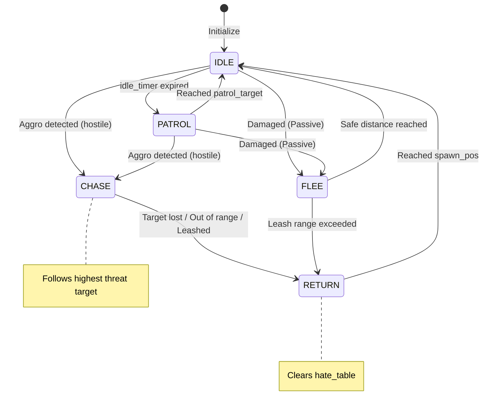

# Tài liệu Hệ thống Mob AI

Tài liệu này mô tả kiến trúc và hành vi của hệ thống Mob AI được triển khai trong MMO RPG Game Server.

## 1. Tổng quan Kiến trúc

Mob AI được xây dựng theo **Kiến trúc dựa trên Component (Component-Based Architecture)** để đảm bảo tính module và khả năng mở rộng.

### Các Component chính
- **Parent Mob (CharacterBody2D):** Node cha chứa tất cả các component, được tham chiếu qua `get_parent()`
- **StatsComponent:** Quản lý HP, Defense và phát tín hiệu `damaged` khi nhận sát thương
- **MobAIComponent:** Component AI chính chứa logic quyết định, di chuyển và quản lý aggro

### Vòng đời khởi tạo
```gdscript
func initialize(config: Dictionary, spawn_pos: Vector2, move_speed: float)
```

Component nhận:
- `config`: Dictionary chứa cấu hình AI từ mob template
- `spawn_pos`: Vị trí xuất hiện ban đầu (điểm neo)
- `move_speed`: Tốc độ di chuyển cơ bản (dùng cho chase_speed)

## 2. Máy trạng thái (Finite State Machine - FSM)

AI sử dụng enum `State` để quản lý 4 trạng thái chính:

```gdscript
enum State {IDLE, PATROL, CHASE, RETURN}
```

### Chi tiết các trạng thái

#### 2.1. IDLE (Nghỉ ngơi)
**Chức năng:**
- Mob đứng yên tại chỗ
- Đếm ngược thời gian qua biến `idle_timer`
- Kiểm tra aggro nếu behavior là `hostile`

**Chuyển trạng thái:**
- Khi `idle_timer <= 0`: Chọn điểm tuần tra ngẫu nhiên → chuyển sang **PATROL**
- Khi phát hiện mục tiêu (hostile behavior): → **CHASE**

**Điểm ngẫu nhiên:**
```gdscript
var random_offset = Vector2(randf_range(-1, 1), randf_range(-1, 1)).normalized() 
                    * randf_range(0, patrol_radius)
patrol_target = spawn_pos + random_offset
```

#### 2.2. PATROL (Tuần tra)
**Chức năng:**
- Di chuyển về phía `patrol_target` với tốc độ `patrol_speed`
- Kiểm tra aggro liên tục mỗi frame

**Chuyển trạng thái:**
- Khi đến gần mục tiêu (`distance < 10.0`): → **IDLE**, đặt `idle_timer = randf_range(1.0, 3.0)`
- Khi phát hiện mục tiêu (hostile): → **CHASE**

**Velocity trả về:**
```gdscript
return mob.position.direction_to(patrol_target) * patrol_speed
```

#### 2.3. CHASE (Truy đuổi)
**Chức năng:**
- Truy đuổi mục tiêu hiện tại (`target`) với tốc độ `chase_speed`
- Kiểm tra điều kiện leash và chase range

**Điều kiện dừng chase (chuyển sang RETURN):**
1. Target không còn hợp lệ (`not is_instance_valid(target)`)
2. Mob đi quá xa khỏi spawn point (`distance_to(spawn_pos) > leash_range`)
3. Target chạy ra khỏi chase range (`distance_to(target.position) > chase_range`)

**Velocity trả về:**
```gdscript
return mob.position.direction_to(target.position) * chase_speed
```

#### 2.4. RETURN (Quay về)
**Chức năng:**
- Di chuyển về điểm xuất hiện ban đầu (`spawn_pos`)
- Sử dụng tốc độ chase_speed

**Chuyển trạng thái:**
- Khi về đến spawn point (`distance < 10.0`):
  - → **IDLE**
  - Đặt `idle_timer = 2.0`
  - **Xóa sạch hate_table** (`hate_table.clear()`)

**Velocity trả về:**
```gdscript
return mob.position.direction_to(spawn_pos) * chase_speed
```

#### 2.5. FLEE (Chạy trốn)
**Chức năng:**
- Di chuyển **ra xa** khỏi attacker
- Áp dụng cho Passive mobs khi bị tấn công

**Điều kiện dừng (chuyển sang IDLE/RETURN):**
1. Đủ xa an toàn: `distance > chase_range` -> IDLE
2. Quá xa spawn point: `distance > leash_range` -> RETURN

**Velocity trả về:**
```gdscript
return target.position.direction_to(mob.position) * chase_speed
```

### Sơ đồ chuyển trạng thái



## 3. Hành vi hung dữ (Aggression Behaviors)

Được định nghĩa qua thuộc tính `behavior` trong cấu hình AI. Ba loại hành vi:

### 3.1. Passive (Thụ động)
```gdscript
if behavior == "passive":
    return  # Không phản ứng khi bị tấn công
```

**Đặc điểm:**
- Không bao giờ tự động aggro
- **Chuyển sang FLEE** khi bị tấn công (thay vì đứng im)
- Luôn ở trạng thái IDLE/PATROL nếu không bị quấy rầy

### 3.2. Neutral (Trung lập)
```gdscript
if (behavior == "neutral" or behavior == "hostile") and is_instance_valid(attacker):
    add_threat(attacker, float(amount))
```

**Đặc điểm:**
- **Không tự động aggro** khi người chơi đi qua
- Chỉ thêm mục tiêu vào hate_table khi bị tấn công
- Sau khi aggro, hành vi tương tự hostile (chase, leash, return)

### 3.3. Hostile (Hung dữ)
```gdscript
func _check_for_aggro():
    if behavior == "passive" or behavior == "neutral":
        return
    # Scan for players in aggro_range...
```

**Đặc điểm:**
- **Tự động aggro** khi phát hiện player trong `aggro_range`
- Gọi `_check_for_aggro()` mỗi frame trong IDLE và PATROL
- Thêm player vào hate_table với threat ban đầu = 1.0

## 4. Bảng hận thù (Hate Table / Threat System)

### 4.1. Cấu trúc dữ liệu
```gdscript
var hate_table: Dictionary = {}  # { Node2D: float (threat) }
```

Lưu trữ ánh xạ từ entity (Node2D) sang điểm threat (float).

### 4.2. Thêm Threat
```gdscript
func add_threat(entity: Node2D, amount: float):
    if not is_instance_valid(entity): return
    
    if not hate_table.has(entity):
        hate_table[entity] = 0.0
        
    hate_table[entity] += amount
    _update_target()
```

**Nguồn threat:**
- Sát thương gây ra: `1 damage = 1 threat` (từ signal `on_damaged`)
- Aggro ban đầu: `1.0 threat` khi hostile mob phát hiện player

### 4.3. Cập nhật Target với Hysteresis
```gdscript
func _update_target():
```

**Logic xử lý:**

1. **Làm sạch hate_table:**
   - Xóa entities không hợp lệ (`not is_instance_valid`)
   - Xóa entities không cùng channel (`channel_id != mob.channel_id`)

2. **Tìm top threat:**
   - Duyệt qua tất cả entities còn lại
   - Chọn entity có threat cao nhất

3. **Quy tắc Hysteresis (10%):**
   ```gdscript
   if target and target != top_target and is_instance_valid(target) and hate_table.has(target):
       var current_threat = hate_table[target]
       if top_threat < current_threat * 1.1:
           return  # Giữ nguyên target hiện tại
   ```
   
   **Giải thích:** Target mới phải có threat **>110%** target hiện tại mới được chuyển đổi.
   
   **Ví dụ:**
   - Target hiện tại: Player A (100 threat)
   - Candidate mới: Player B (105 threat)
   - Kết quả: Giữ nguyên Player A (vì 105 < 100 * 1.1 = 110)

4. **Chuyển sang CHASE:**
   ```gdscript
   target = top_target
   current_state = State.CHASE
   ```

### 4.4. Reset Hate Table
```gdscript
# Trong _process_return():
if dist < 10.0:
    hate_table.clear()  # Xóa sạch khi về đến spawn_pos
```

**Timing reset:**
- Chỉ reset khi mob về đến spawn point hoàn toàn
- Không reset khi đang chase hoặc leash
- Cho phép mob "nhớ" target trong quá trình return

## 5. Cô lập Kênh (Channel Isolation)

Hệ thống đảm bảo mobs chỉ tương tác với entities trong cùng channel.

### 5.1. Kiểm tra trong _check_for_aggro
```gdscript
for player in players:
    if player.get("channel_id") != mob.channel_id:
        continue
    
    if mob.position.distance_to(player.position) < aggro_range:
        add_threat(player, 1.0)
```

### 5.2. Làm sạch hate_table
```gdscript
for entity in hate_table.keys():
    if entity.get("channel_id") != mob.channel_id:
        to_remove.append(entity)
```

**Kịch bản:**
1. Player ở Channel 1 tấn công mob
2. Mob aggro và chase
3. Player chuyển sang Channel 2 (hoặc disconnect/teleport)
4. Mob tự động xóa player khỏi hate_table trong `_update_target()`
5. Mob chuyển sang RETURN state

## 6. Cấu hình AI Parameters

### 6.1. Khởi tạo từ Config
```gdscript
var ai_config = config.get("ai", {})
aggro_range = ai_config.get("aggroRange", 200.0)
chase_range = ai_config.get("chaseRange", 400.0)
leash_range = ai_config.get("leashRange", 500.0)
patrol_radius = ai_config.get("patrolRadius", 100.0)
patrol_speed = ai_config.get("patrolSpeed", 50.0)
behavior = ai_config.get("behavior", "hostile")
```

### 6.2. Bảng tham số

| Tham số | Giá trị mặc định | Đơn vị | Mô tả |
|---------|-----------------|--------|-------|
| `aggroRange` | 200.0 | pixels | Bán kính phát hiện player (chỉ hostile) |
| `chaseRange` | 400.0 | pixels | Khoảng cách tối đa đuổi theo target |
| `leashRange` | 500.0 | pixels | Khoảng cách tối đa xa spawn point |
| `patrolRadius` | 100.0 | pixels | Bán kính di chuyển ngẫu nhiên khi tuần tra |
| `patrolSpeed` | 50.0 | pixels/s | Tốc độ khi PATROL |
| `chase_speed` | (từ move_speed) | pixels/s | Tốc độ khi CHASE/RETURN |
| `behavior` | "hostile" | string | "passive" \| "neutral" \| "hostile" |

### 6.3. Quan hệ giữa các Range
**Khuyến nghị:** `aggroRange < chaseRange < leashRange`

**Ví dụ hợp lý:**
```json
{
  "aggroRange": 200,
  "chaseRange": 400,
  "leashRange": 500
}
```

**Giải thích:**
- Mob phát hiện ở 200px → bắt đầu chase
- Player chạy ra 400px → mob dừng chase, return
- Nếu mob đã đuổi ra xa 500px khỏi spawn → bắt buộc return ngay lập tức

## 7. Luồng xử lý chính (Main Loop)

### 7.1. Integration với Parent Mob
Parent Mob gọi AI component mỗi frame:
```gdscript
func physics_process(delta: float) -> Vector2:
    match current_state:
        State.IDLE:   return _process_idle(delta)
        State.PATROL: return _process_patrol(delta)
        State.CHASE:  return _process_chase(delta)
        State.RETURN: return _process_return(delta)
        State.FLEE:   return _process_flee(delta)
    return Vector2.ZERO
```

**Return value:** Vector2 velocity để parent mob áp dụng vào `move_and_slide()`

### 7.2. Tích hợp với StatsComponent
Khi mob nhận sát thương, StatsComponent emit signal:
```gdscript
# Trong parent Mob hoặc StatsComponent
signal damaged(amount: int, attacker: Node)

# AI Component lắng nghe:
func on_damaged(amount: int, attacker: Node):
    if behavior == "passive":
        return
        
    if (behavior == "neutral" or behavior == "hostile") and is_instance_valid(attacker):
        add_threat(attacker, float(amount))
```

## 8. Tối ưu hóa và Performance

### 8.1. Distance Checks
**Hiện tại:** Code sử dụng `distance_to()` (có sqrt)
```gdscript
if mob.position.distance_to(player.position) < aggro_range:
```

> [!NOTE]
> **Tối ưu hóa đã được đề cập trong tài liệu cũ**: Có thể cải thiện bằng cách sử dụng `distance_squared_to()` để tránh căn bậc hai:
> ```gdscript
> if mob.position.distance_squared_to(player.position) < aggro_range * aggro_range:
> ```

### 8.2. Entity Validation
Kiểm tra `is_instance_valid()` trước khi truy cập entity:
- Tránh lỗi khi player disconnect
- Tự động làm sạch hate_table

### 8.3. Channel Filtering
Lọc sớm entities không cùng channel:
- Giảm số lượng checks trong `_check_for_aggro()`
- Tránh xử lý thừa trong `_update_target()`

## 9. Edge Cases và Xử lý lỗi

### 9.1. Player Disconnect
```gdscript
if not is_instance_valid(target):
    current_state = State.RETURN
```
Mob tự động return khi target mất.

### 9.2. Multiple Attackers
Hate table tự động quản lý nhiều attackers:
- Mỗi attacker có điểm threat riêng
- Hysteresis ngăn switching liên tục
- Target luôn là highest threat

### 9.3. Channel Switching
Mob tự động xóa entities không cùng channel trong `_update_target()`.

### 9.4. Leash Breaking
```gdscript
if mob.position.distance_to(spawn_pos) > leash_range:
    target = null
    current_state = State.RETURN
```
Ưu tiên quay về spawn hơn là chase target.

## 10. Debug và Monitoring

### 10.1. Debug Logging
```gdscript
print("🧠 AI Init: Aggro %.0f Chase %.0f Behavior: %s" % [aggro_range, chase_range, behavior])
# print("🎯 Logic Target: %s (Threat: %.1f)" % [target.name, top_threat])  # Commented out
```

### 10.2. State Visualization
Để debug trực quan, có thể thêm:
- Vẽ circle cho aggro_range, chase_range, leash_range
- Hiển thị hate_table values trên màn hình
- Color coding theo state (IDLE=xanh, PATROL=vàng, CHASE=đỏ, RETURN=xám)

## 12. Hệ thống Respawn (Tái sinh)

### 12.1. Random Variance (Biến thiên ngẫu nhiên)
Để tránh hiện tượng "Synchronized Spawning" (quái respawn đồng loạt cùng lúc), hệ thống áp dụng biến thiên ngẫu nhiên cho timer:

```gdscript
var base_respawn_time = 5.0
var respawn_time = base_respawn_time * randf_range(0.8, 1.2)
```

**Kết quả:**
- Thời gian hồi sinh thực tế dao động +/- 20%.
- Ví dụ: 5s base -> thực tế 4.0s đến 6.0s.

## 13. Roadmap và Cải tiến

### 13.1. Tính năng đã hoàn thành
- [x] **Flee System:** Passive mobs chạy trốn khi bị tấn công.
- [x] **Respawn Logic:** Random variance cho respawn timer.

### 13.2. Đề xuất cải tiến (Game Design Roadmap)

#### Priority 1: Gameplay Depth (Chiều sâu Gameplay)
- **Combat Abilities (Skill System):** Mobs cần có kỹ năng (Stun, AoE, Heal) thay vì chỉ đánh thường. Đây là yếu tố quyết định sự thú vị của combat.
- **Ranged AI (Kiting Behavior):** Mobs đánh xa (Cung thủ, Pháp sư) biết giữ khoảng cách. Nếu player lại gần -> chạy lùi rồi bắn tiếp (Hit & Run).
- **Social Aggro (Chain Pulls):** Khi đánh 1 con, các con cùng loại xung quanh tự động lao vào. Tạo cảm giác "One for all, all for one".

#### Priority 2: Replayability (Giá trị chơi lại)
- **Elite Affixes (Modifier System):** Quái Elite không chỉ trâu hơn, mà có thêm thuộc tính ngẫu nhiên (Ví dụ: *Explosive* - nổ khi chết, *Vampiric* - hút máu, *Swift* - chạy nhanh).
- **Rare Mobs:** Quái hiếm với loot xịn, spawn ngẫu nhiên thời gian dài.

#### Priority 3: Boss Mechanics
- **Boss Phases:** AI thay đổi theo % máu (75% -> Enrage, 50% -> Gọi đệ, 25% -> Tuyệt chiêu cuối).
- **Telegraphing:** Hiển thị vùng nguy hiểm (Red zone) trên mặt đất trước khi tung skill mạnh để player né.
