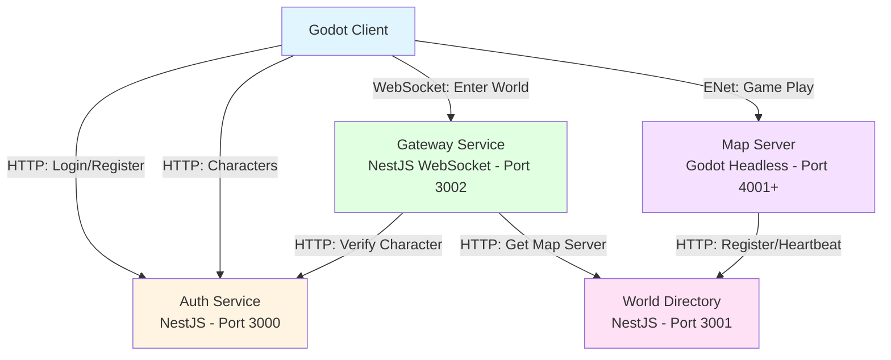
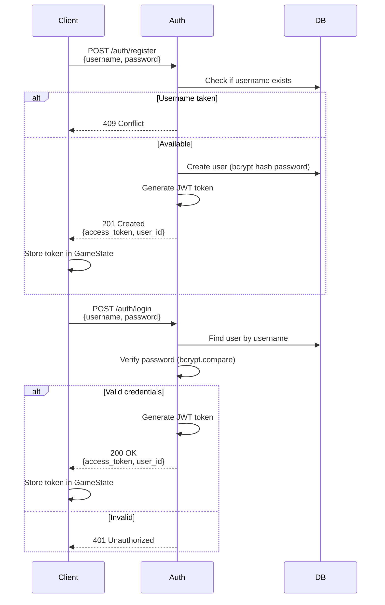
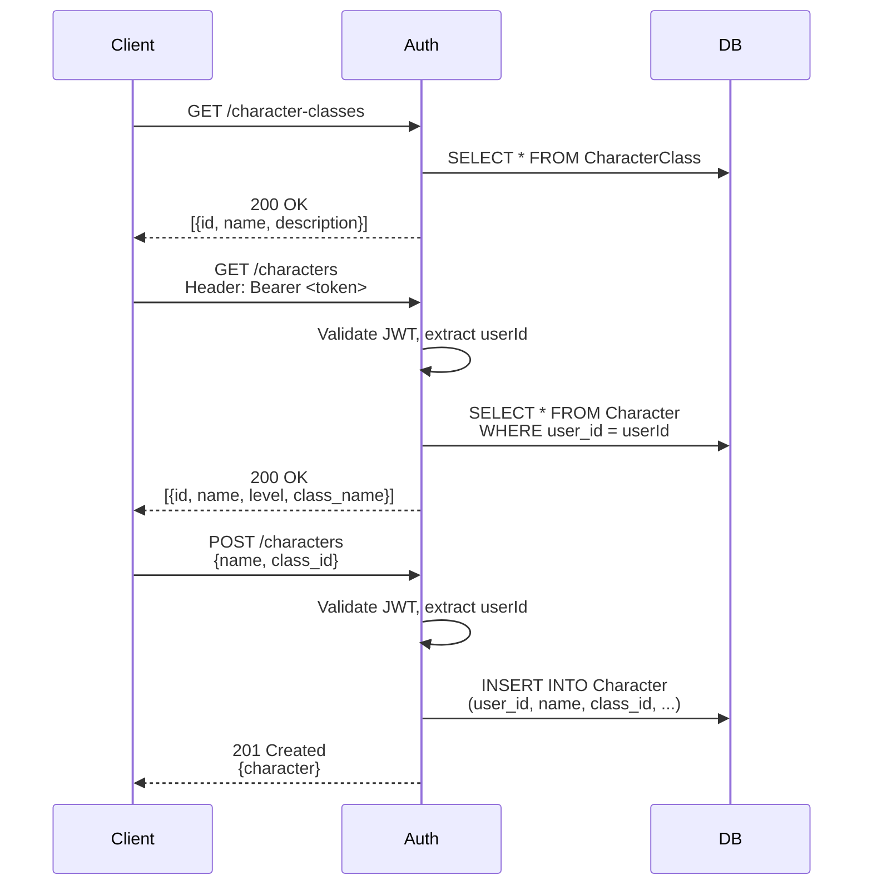
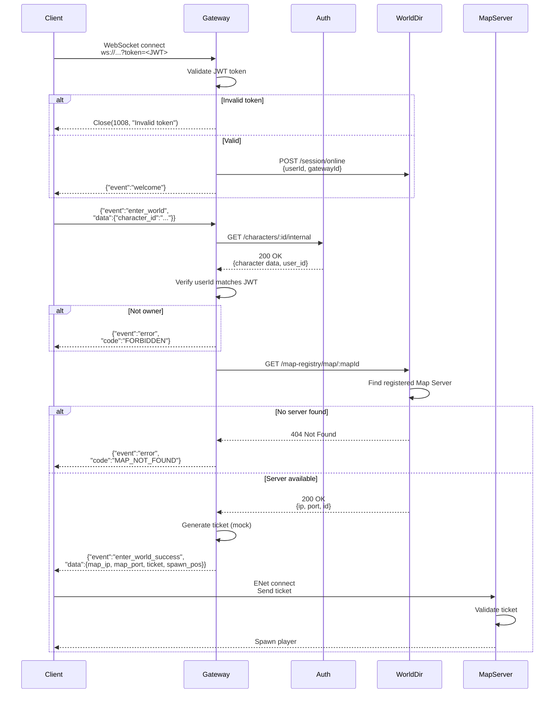
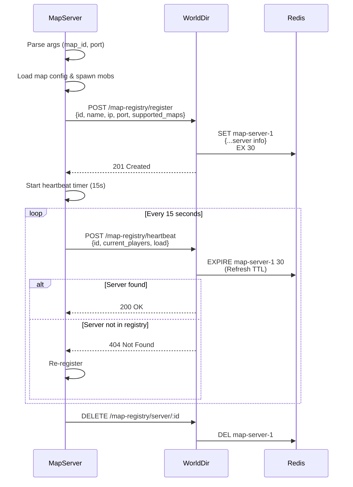

# MMO RPG Game - System Architecture & Service Workflows

## System Overview

The MMO RPG system consists of 4 main services working together:



---

## Service Details

### 1. Auth Service (Port 3000)
**Technology**: NestJS + Prisma + PostgreSQL  
**Responsibilities**:
- User authentication (register/login)
- Character management (CRUD)
- Character class data
- JWT token generation

**Key Endpoints**:
| Method | Endpoint | Auth | Description |
|--------|----------|------|-------------|
| POST | `/auth/register` | ❌ | Create new user account |
| POST | `/auth/login` | ❌ | Login and get JWT token |
| GET | `/characters` | ✅ | Get user's characters |
| POST | `/characters` | ✅ | Create new character |
| GET | `/characters/:id/internal` | ❌ | Internal: Get character for gateway |
| GET | `/character-classes` | ❌ | Get available classes |

**Environment Variables**:
```env
PORT=3000
DATABASE_URL=postgresql://...
JWT_SECRET=your-super-secret-jwt-key-change-this-in-production
```

---

### 2. World Directory (Port 3001)
**Technology**: NestJS + Redis  
**Responsibilities**:
- Map Server registry (discovery service)
- Session management (track online users)
- Map allocation for players

**Key Endpoints**:
| Method | Endpoint | Auth | Description |
|--------|----------|------|-------------|
| POST | `/map-registry/register` | ❌ | Map Server self-registration |
| POST | `/map-registry/heartbeat` | ❌ | Map Server health check |
| GET | `/map-registry/map/:mapId` | ❌ | Find server hosting a map |
| POST | `/session/online` | ❌ | Mark user online |
| DELETE | `/session/:userId` | ❌ | Remove user session |

**Environment Variables**:
```env
PORT=3001
REDIS_URL=redis://localhost:6379
```

---

### 3. Gateway Service (Port 3002)
**Technology**: NestJS + WebSocket (ws library)  
**Responsibilities**:
- WebSocket connection hub
- JWT validation for clients
- Character ownership verification
- Map allocation coordination

**WebSocket Messages**:
| Event | Direction | Payload | Description |
|-------|-----------|---------|-------------|
| `connect` | Client → Server | `?token=<JWT>` | Initial connection with auth |
| `welcome` | Server → Client | `{message}` | Connection confirmed |
| `enter_world` | Client → Server | `{character_id}` | Request to enter game world |
| `enter_world_success` | Server → Client | `{map_ip, map_port, ticket, spawn_pos}` | Map allocation result |
| `error` | Server → Client | `{code, message}` | Error notification |

**Environment Variables**:
```env
GATEWAY_PORT=3002
AUTH_SERVICE_URL=http://localhost:3000
WORLD_DIRECTORY_URL=http://localhost:3001
JWT_SECRET=your-super-secret-jwt-key-change-this-in-production
GATEWAY_ID=gateway-1
```

---

### 4. Map Server (Port 4001+)
**Technology**: Godot 4.x (Headless)  
**Responsibilities**:
- Game world simulation
- Player movement & combat
- Mob AI & spawning
- Physics & collision
- Channel isolation

**Self-Registration Flow**:
```json
POST http://localhost:3001/map-registry/register
{
  "id": "map-server-1",
  "name": "Map Server 1",
  "ip": "127.0.0.1",
  "port": 4001,
  "supported_maps": [1],
  "max_players": 100
}
```

**Heartbeat (every 15s)**:
```json
POST http://localhost:3001/map-registry/heartbeat
{
  "id": "map-server-1",
  "current_players": 5,
  "load": 5
}
```

**Environment Variables**:
```bash
WORLD_DIRECTORY_URL=http://localhost:3001  # Optional, defaults to localhost:3001
SERVER_IP=127.0.0.1  # Optional, defaults to 127.0.0.1
```

**Command Line Args**:
```bash
./start_server.sh <map_id> <port>
# Example: ./start_server.sh 1 4001
```

---

## Complete Workflows

### Workflow 1: User Registration & Login



---

### Workflow 2: Character Selection



---

### Workflow 3: Enter World (Critical Flow)



---

### Workflow 4: Map Server Lifecycle



---

## Key Technical Decisions

### Authentication
- **JWT Tokens**: Stateless auth, shared secret between Auth & Gateway
- **Secret**: `JWT_SECRET` env var (must match across services)
- **Token Payload**: `{userId: string, iat: number, exp: number}`

### Service Discovery
- **Registry**: World Directory acts as service registry
- **Discovery**: Gateway queries World Directory for Map Servers
- **Health Check**: Heartbeat every 15s, TTL 30s in Redis

### Map Server Registration
- **Self-Registration**: Map Servers register themselves on startup
- **Retry Logic**: Exponential backoff (5s, 10s, 15s... max 30s)
- **Max Retries**: 10 attempts
- **Auto-Recovery**: Re-register if heartbeat returns 404

### Data Flow
- **Authentication**: Client ↔ Auth (HTTP/REST)
- **Real-time**: Client ↔ Gateway (WebSocket)
- **Gameplay**: Client ↔ Map Server (ENet)
- **Service-to-Service**: HTTP/REST

---

## Port Summary

| Service | Port | Protocol | URL |
|---------|------|----------|-----|
| Auth Service | 3000 | HTTP | http://localhost:3000 |
| World Directory | 3001 | HTTP | http://localhost:3001 |
| Gateway Service | 3002 | WebSocket | ws://localhost:3002/ws |
| Map Server (Main) | 4001 | ENet | - |
| Map Server (Additional) | 4002+ | ENet | - |

---

## Startup Sequence

### Backend Services
```bash
cd backend
./scripts/start-dev.sh
```

This script:
1. Kills existing processes on ports 3000, 3001, 3002
2. Starts Auth Service (port 3000)
3. Starts World Directory (port 3001)
4. Starts Gateway Service (port 3002)
5. Logs to `logs/auth.log`, `logs/world.log`, `logs/gateway.log`

### Map Server
```bash
cd server
./start_server.sh 1 4001
```

This:
1. Starts Godot headless instance
2. Loads Map ID 1
3. Listens on port 4001
4. Registers with World Directory
5. Logs to `map_server.log`

### Client
```bash
# Open Godot Editor and run project
# OR export and run executable
```

Flow:
1. Login scene (main scene)
2. Character Select scene
3. World scene (connects to Map Server)

---

## Security Considerations

### Current (Development)
- JWT secret is shared via environment variables
- Mock tickets for map server auth
- No HTTPS/WSS (plain HTTP/WS)
- Passwords hashed with bcryptjs

### Production Requirements
- **HMAC Tickets**: Real cryptographic tickets for Map Server
- **HTTPS/WSS**: TLS encryption for all connections
- **JWT Rotation**: Short-lived tokens with refresh mechanism
- **Rate Limiting**: Protect against abuse
- **Input Validation**: Already implemented via class-validator
- **Secret Management**: Use vault (not env vars)

---

## Troubleshooting

### "FORBIDDEN - You do not own this character"
- **Cause**: `JwtAuthGuard` on `/characters/:id/internal`
- **Fix**: Remove guard from internal endpoint (already fixed)

### "MAP_NOT_FOUND"
- **Cause**: No Map Server registered for requested map
- **Fix**: Start Map Server with `./start_server.sh <map_id> <port>`

### Gateway fails to validate JWT
- **Cause**: `JWT_SECRET` mismatch between Auth & Gateway
- **Fix**: Ensure identical secret in both `.env` files

### Map Server registration fails
- **Cause**: World Directory not running or wrong URL
- **Fix**: Check World Directory is on port 3001
- **Fix**: Set `WORLD_DIRECTORY_URL` env var if needed

---

## Monitoring

### Logs
```bash
# Backend logs
tail -f backend/logs/auth.log
tail -f backend/logs/world.log
tail -f backend/logs/gateway.log

# Map Server log
tail -f server/map_server.log
```

### Key Log Messages
```
✅ Registered with World Directory successfully!  # Map Server OK
👋 Welcome message: Connected to Gateway         # Client connected
User <id> connected                               # Gateway accepted client
```

### Redis Monitoring
```bash
redis-cli
> KEYS map-server-*
> GET map-server-1
> TTL map-server-1
```
