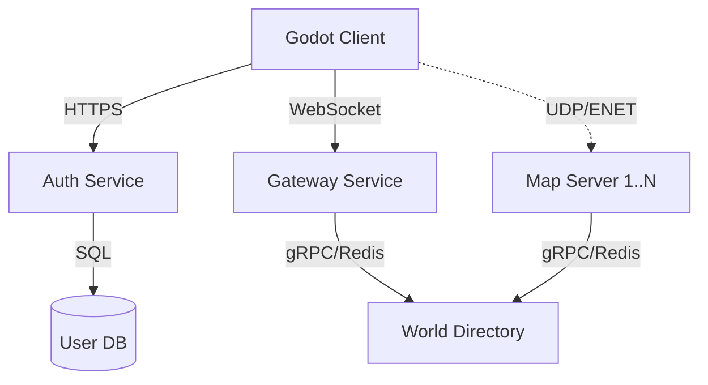

# Backend Architecture Design (Gateway & Auth)

## 1. Tổng quan Kiến trúc (High-Level Overview)

Mô hình Microservices / Distributed Server cho MMO RPG.

## 2. Giao thức tối ưu (Protocol Selection)

### 2.1. Authentication Service (Dịch vụ Xác thực)
**Recommendation: RESTful API (HTTPS)**

*   **Tại sao:**
    *   **Stateless:** Auth là hành động "Request-Response" (Gửi user/pass -> Nhận Token). Không cần duy trì kết nối lâu dài.
    *   **Standard:** Dễ dàng tích hợp với Web Portal, Mobile App, 3rd party (Google/Facebook Login).
    *   **Scaling:** Dễ dàng scale ngang (Load Balancer -> N node Auth Service).
*   **Technology:** NodeJS (Express/NestJS) hoặc Go (Gin).

### 2.2. Gateway Service (Cổng kết nối chính)
**Recommendation: WebSocket (Stateful)**

*   **Tại sao:**
    *   **Session Management:** Gateway cần biết Client có đang "Online" hay không (dù chưa vào Map).
    *   **Push Notifications:** Server cần chủ động đẩy tin nhắn cho Client (Ví dụ: "Bạn nhận được lời mời Party", "Server sắp bảo trì", "Tin nhắn Chat Global"). REST không làm được việc này hiệu quả (phải Long Polling).
    *   **Low Latency:** WebSocket nhanh hơn HTTP cho các tác vụ thời gian thực nhỏ.
*   **Chức năng:**
    *   Giữ kết nối duy trì (Keep-alive).
    *   Routing Chat (Global/Whisper).
    *   Matchmaking / Map Routing (Xin IP Map Server).
    *   Party / Guild Management (Metagame features).

### 2.3. Map Server (Game Logic)
**Recommendation: Godot High-level Multiplayer (ENet over UDP)**

*   **Tại sao:**
    *   Gameplay cần độ trễ thấp nhất có thể -> UDP.
    *   Godot hỗ trợ native.

## 3. Workflow Chi tiết

### 3.1. Login Flow (REST)
1.  Client -> **Auth Service** (`POST /login`): Gửi username/password.
2.  Auth Service -> **DB**: Verify hash.
3.  Auth Service -> Client: Trả về `AccessToken` (JWT).

### 3.2. Gateway Connection (WebSocket)
1.  Client -> **Gateway** (Connect WS): Gửi `AccessToken` trong handshake header.
2.  Gateway: Validate Token.
3.  Gateway: Đánh dấu User "Online" trong **World Directory** (Redis).

### 3.3. Join Map Flow (Service Discovery)
1.  Client -> **Gateway** (WS Message `Cmd: JoinMap`): "Cho tôi vào Map 1".
2.  Gateway -> **World Directory**: "Map 1 đang ở đâu?".
3.  Gateway -> Client: "Map 1 ở IP 10.0.0.5, Port 3000. Đây là Ticket vào cửa".
4.  Client -> **Map Server** (UDP Connect): Gửi Ticket.
5.  Map Server: Verify Ticket -> Spawn Player.

## 4. Công nghệ đề xuất (Tech Stack)

| Service | Protocol | Tech Stack (Suggest) | Database |
| :--- | :--- | :--- | :--- |
| **Auth** | HTTPS (REST) | NestJS / Go / Python FastAPI | PostgreSQL (User Data) |
| **Gateway** | WebSocket | NestJS (Socket.io) / Go (Gorilla) | Redis (PubSub/Session) |
| **World Directory** | Internal (gRPC) | Go / NestJS | Redis (State) |
| **Map Server** | UDP (ENet) | Godot (Headless) | None (In-memory) |

## 5. Kết luận
- Đùng **REST** cho Auth vì nó chuẩn, dễ và an toàn.
- Dùng **WebSocket** cho Gateway vì tính chất "Real-time" và "Push" của MMO (Chat, Invite, Status).
- Dùng **Hybrid** là mô hình tối ưu nhất hiện nay cho MMO hiện đại.
